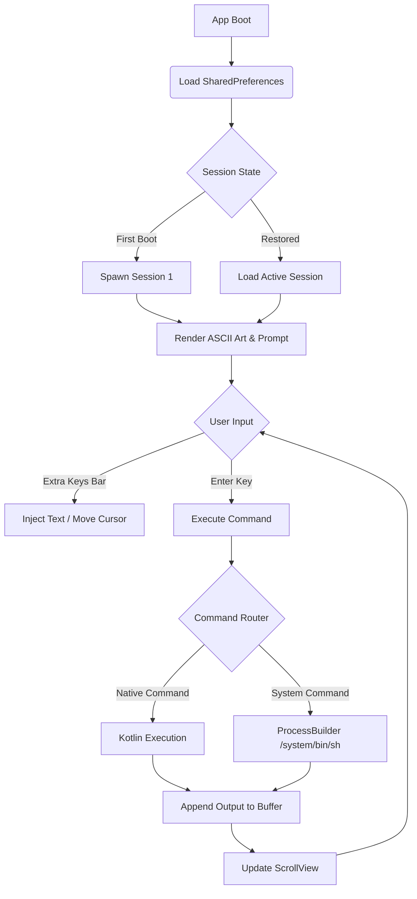

<h1 align="center">TER-BILITY</h1>
<h3 align="center">Native Android Terminal Emulator</h3>

  A lightweight, native Android terminal emulator built entirely from Termux using GitHub Actions for CI/CD. Features inline typing, multi-session management, custom theming, and native Linux command execution without requiring root access.

  
  
  
  

---

## The Mission: Frictionless Native Execution

Standard Android terminal emulators often rely on bulky external binaries or require root access to function properly. This creates friction and limits accessibility for standard users. 

TER-BILITY acts as a direct, native execution relay. By leveraging Java's `ProcessBuilder` and custom Kotlin command interceptors, the application establishes a direct bridge to Android's `/system/bin/sh`. Users can spawn multiple isolated sessions, execute native Linux commands, and manage files instantly. No root, no bulky dependencies, no server requirements.

The latest evolution introduces a true Termux-like experience—complete with an inline typing interface, custom accent color theming, command history cycling, and an expanded control keys bar—entirely within the constraints of a native Android application.

---

## Tactical Features & Engineering Decisions

* **Native Command Interceptor Engine:** 
  Instead of fighting Android's W^X (Write XOR Execute) security policy that blocks external binary execution, TER-BILITY implements a custom Kotlin-based command router. Core Linux utilities (`ls`, `cd`, `mkdir`, `rm`, `touch`, `cat`, `mv`, `cp`, `tree`) are executed natively within the app's runtime. Unsupported commands automatically fall back to Android's system shell, ensuring maximum compatibility without permission denials.
* **Stateful Session Management:** 
  True multitasking requires isolated environments. The app utilizes a `DrawerLayout` sidebar to spawn and manage multiple terminal sessions. Each session maintains its own `TerminalExec` instance, preserving individual working directories, command history, and output buffers independently. Switching between sessions instantly restores the exact terminal state.
* **True Inline Typing Interface:** 
  Standard Android `EditText` components break the terminal aesthetic. TER-BILITY fakes a direct terminal interface by binding a borderless `EditText` directly to the end of a `ScrollView`. A custom XML `textCursorDrawable` replaces the default Android caret with a thick, solid white block, mimicking a true TTY cursor. 
* **Path Resolution & Canonical Routing:** 
  Android's file system structure can be unpredictable (e.g., `/data/data/` vs `/data/user/0/`). The engine uses Java's `.canonicalFile` method to mathematically resolve `.`, `..`, and `~` paths. This ensures that the prompt always displays the clean, logical path (e.g., `₹~/tejas/`) regardless of underlying symlink structures.
* **Expanded Control Keys Suite:** 
  Mobile keyboards lack essential terminal keys. The app integrates a horizontally scrollable `HorizontalScrollView` at the bottom of the screen, injecting `ESC`, `TAB`, `CTRL`, `ALT`, History Up/Down (`-`/`=`), Arrow Keys (`←`/`→`), `HOME`, `END`, `/`, and `|`. Haptic feedback is triggered on every press to simulate physical keyboard actuation.
* **Persistent Custom Theming:** 
  The UI engine supports both Dark and Light modes. Accent colors (Deep Pink, Cyber Cyan, etc.) are stored via `SharedPreferences` and dynamically applied to the terminal prompt and ASCII art using Android's `Html.fromHtml` text rendering, allowing instant visual reconfiguration without reloading the activity.

---

## Connection Architecture

GitHub natively supports Mermaid.js diagrams. Below is the visual map of how TER-BILITY establishes a command execution pipeline and manages state:

---

## How to Deploy and Use

This application is built using GitHub Actions and releases pre-compiled APKs automatically. You can install the latest version directly from the repository's Release page.

### 1. Installation
1. Navigate to the **Releases** section of this repository.
2. Download the latest `app-debug.apk` file to your Android device.
3. Open the file and allow installation from unknown sources if prompted by your system.

### 2. Establish Terminal Session
1. Open TER-BILITY. The terminal will boot, displaying the ASCII art banner.
2. Tap the input area at the bottom of the screen to bring up the keyboard.
3. Type standard Linux commands (e.g., `mkdir folder`, `cd folder`, `ls`, `tree`) and press **Enter** or the keyboard's **Action Done** button to execute.
4. Use the **Extra Keys Bar** at the bottom for symbols and navigation. Swipe left/right to reveal more keys like `HOME` and `END`.

### 3. Session & Settings Management
* **New Session:** Swipe right from the left edge of the screen to open the drawer. Click **+ New Session** to spawn a fresh terminal instance.
* **Switch Sessions:** Tap any active session in the drawer to instantly switch contexts.
* **Customize Theme:** Click **Settings** in the drawer. Choose between Dark/Light modes and select your preferred prompt accent color. The terminal updates instantly upon returning.

---

## Tech Stack

* **Kotlin & Android SDK:** Core application logic, UI rendering, and lifecycle management.
* **Java ProcessBuilder:** Direct pipeline execution to Android's native `/system/bin/sh` for fallback commands.
* **Android SharedPreferences:** Local persistence for theme state, accent colors, and UI preferences.
* **Jetpack DrawerLayout:** Native Android implementation for the multi-session sidebar.
* **GitHub Actions:** CI/CD pipeline for automated Gradle compilation, APK signing, and GitHub Releases deployment.
* **Mermaid.js:** Documentation architecture mapping.

---

## Developer

**Tej uzumaki (Tejas Gafat)**
